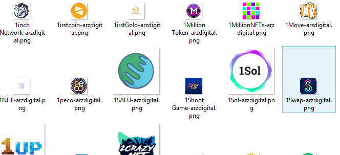

# cryptocurrency-icons-crawler
## web crawler with python using BeautifulSoup library.
this code is a python web crawler that download about 8000 icons of cryptocurrencies
the icons downloaded from www.arzdigital.com

### config.py file
this config file is mostly for privacy and use in codes that have personal variables such passwords or API KEYS and ...
it is not neccessary here and can save the variables in code.py file too.

### This screenshot is a sample of icons:
